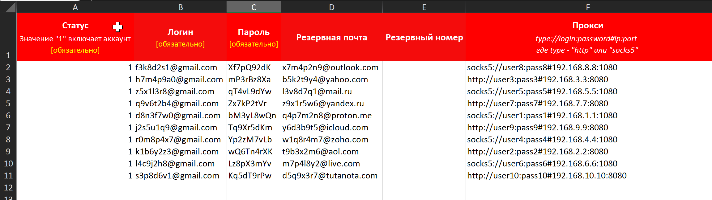

#### 💻Менеджер аккаунтов

Для добавления аккаунтов в шаблоны используется таблица Excel с названием **\[Accounts\].xlsx**, которая расположена в папке проекта. Далее эта таблица будет именоваться как **Менеджер аккаунтов**.

В Менеджер аккаунтов можно добавить любое количество аккаунтов вплоть до – `1 000 000` строк.

Чтобы добавить аккаунт, необходимо заполнить `3` обязательных поля и `3` опциональных.

**🟥Обязательные поля:**

1. Статус

2. Логин

3. Пароль

**🟨Опциональные поля:**

1. Резервная почта

2. Резервный номер

3. Прокси

Остальные поля: `URL`, `Название`, `Аккаунт занят` шаблон заполняет сам.

#### **✏️ Что указывать в поле статус?**

Для включения аккаунта в работу в поле **“Статус”** необходимо указать значение: `1`

После успешного завершения работы с аккаунтом в поле будет записан статус: `Выполнено`

Если во время работы возникнет ошибка, из-за которой шаблон не сможет продолжать работу, в поле будет записано значение с ошибкой. Например: `AccountDisabled` `ChannelNotExist` и др.

Чтобы снова включить аккаунт в работу, необходимо также указать значение: `1`

Автоматически аккаунты после завершения работы не включаются. Это необходимо делать вручную!

#### **✏️** Обязательно ли указывать резервную почту?

В [**требованиях к аккаунтам**](./requirements) указано обязательное наличие резервной почты в настройках безопасности аккаунта для прохождения верификации. Тем не менее, в Менеджере аккаунтов поле для резервной почты не является обязательным, и в исключительных случаях его можно не заполнять.

#### **✏️** В каком формате указывать прокси?

**Формат:**

-  `type://login:password#ip:port`

-  `type://ip:port`

**Примеры:**

`http://etcfncdu:Rn69HW8pHg#192.168.1.10:4001`

`socks5://Applaud:9Q4v8aQ7u80H#192.168.1.10:4010`

`http://192.168.1.10:4001`

`socks5://192.168.1.10:4010`
