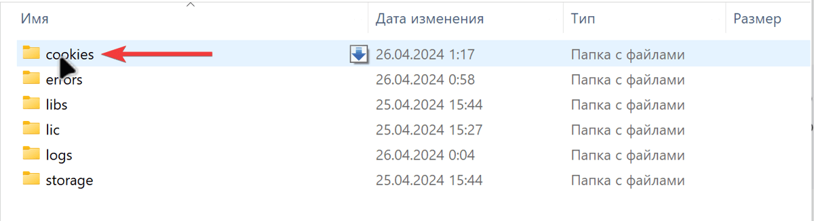
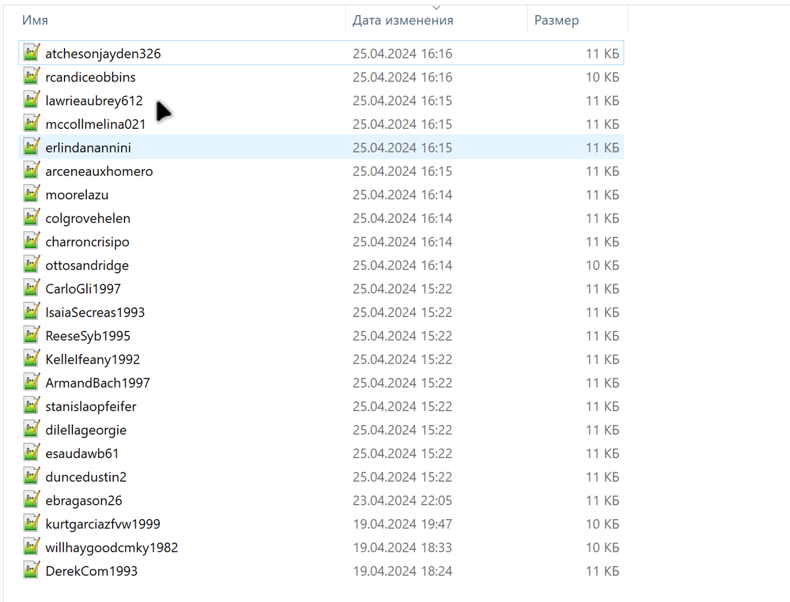
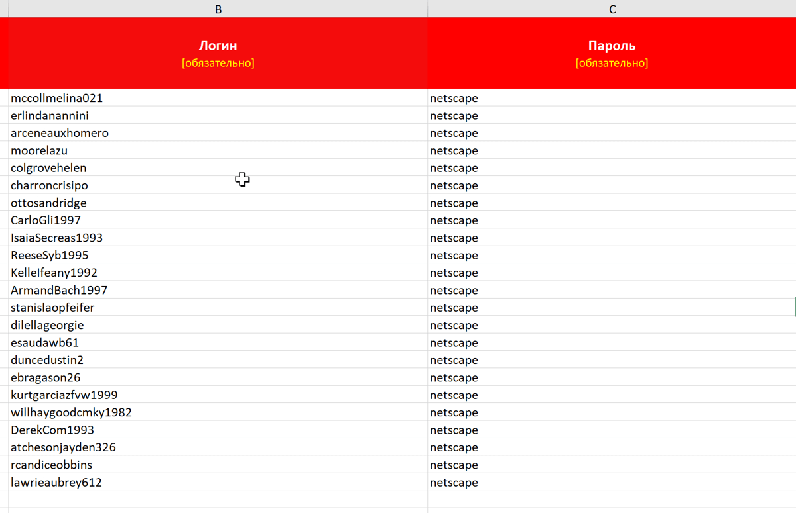
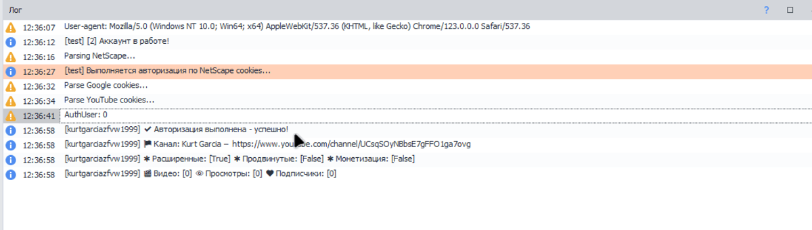

:::danger Внимание!

Поддерживается cookies только ваших личных или купленных в магазинах аккаунтов, к которым у вас есть доступ по логину и паролю. Любые другие cookies сомнительного происхождения использовать по назначению в шаблонах не получится!

:::

Шаблоны **YouTube-Uploader, YouTube-Manager и YouTube-Poster** поддерживают импорт cookies-файлов в формате NetScape из браузеров и других программ, которые поддерживают или могут конвертировать данные cookies в формат NetScape. Импорт cookies в шаблоны позволяет использовать уже существующую сессию из браузера или другого ПО и не производить новую авторизацию в аккаунте по логину и паролю.

Импорт cookies может быть полезен когда по каким-то причинам не удаётся войти в аккаунт через шаблоны по логину или паролю, или когда необходимо обойти двухфакторную аутентификацию аккаунта не отключая её.

#### **Как импортировать cookies-файлы?**

1. Экспортируйте cookies из браузера или другого ПО в формате NetScape и сохраните их в виде текстовых файлов с расширением «.txt», где один текстовый файл с данными cookies - это один канал YouTube.

2. Перенесите cookies-файлы в папку «..\\\\\[Config\]\\\\cookies\\\\», которая находится в директории проекта целевого шаблона.

1. Скопируйте названия текстовых файлов с данными cookies и вставьте названия файлов в поле логин в таблицу с аккаунтами «\[Accounts\].xlsx».

2. В поле «Пароль» укажите значение «netscape» для каждого импортированного названия cookies-файла в таблицу с аккаунтами.

   

Если всё было сделано правильно, то шаблон включит режим работы с cookies и войдёт в аккаунты без авторизации.

