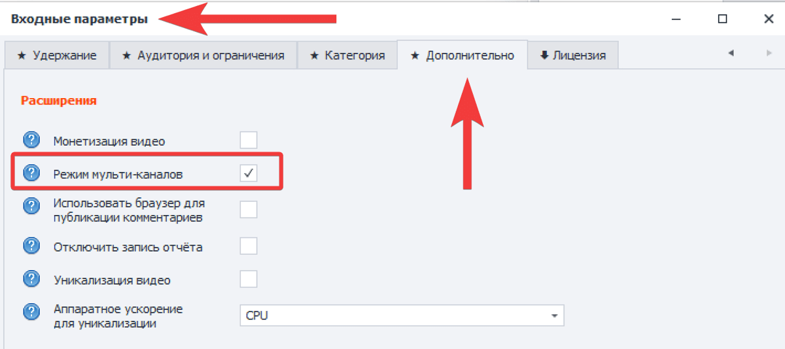
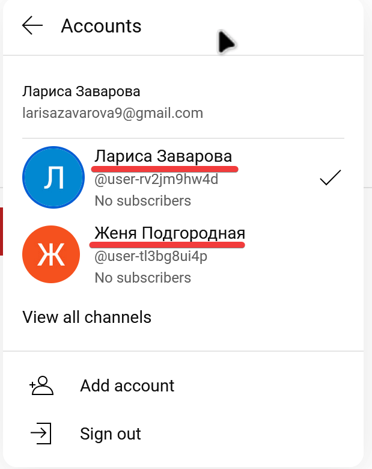
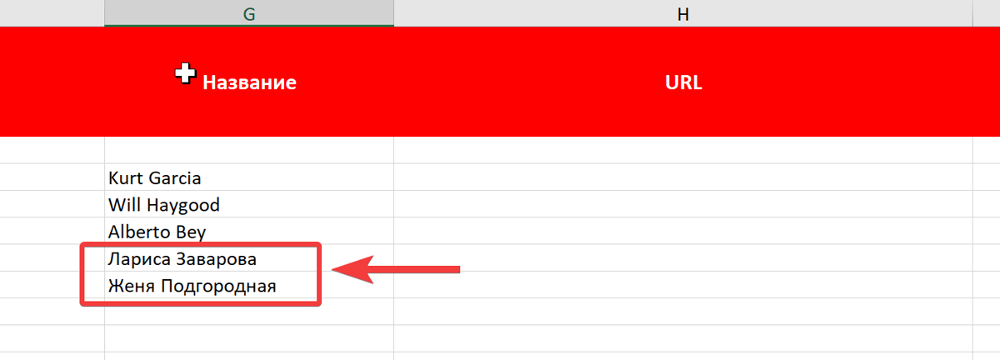
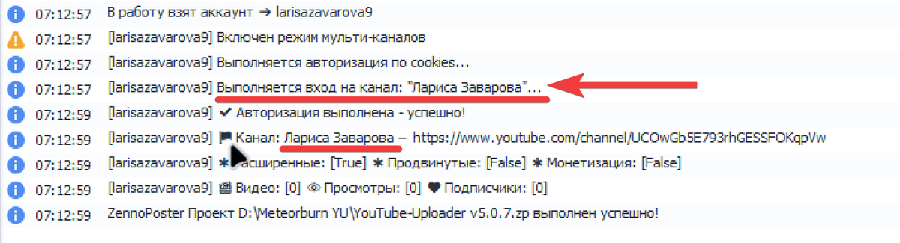

Шаблоны **YouTube-Uploader, YouTube-Manager и YouTube-Poster** поддерживают работу с несколькими каналами на аккаунте и подключенными каналами бренда.

Функция называется «**режим мульти-каналов**». Этот режим даёт возможность пользователю указать канал на аккаунте, в который нужно выполнить вход для выполнения действий.

Режим мульти-каналов необходимо включать только тогда, когда ожидается работа с аккаунтами где создано несколько каналов, и когда необходимо выполнить вход в конкретный канал на аккаунте. Если на аккаунте множество каналов, но надобности использовать другие каналы на аккаунте нет, и шаблон автоматически использует желаемый канал, то включать режим мульти-каналов не нужно. Иначе это приведёт к непредвиденному поведению и ошибкам.

1. Для использования режима мульти-каналов необходимо во входных настройках шаблона на вкладке «**Дополнительно**» в категории «**Расширения**» включить режим поставив галочку.

1. Затем заполнить таблицу «\[Accounts\].xlsx данными аккаунтами с несколькими каналами на них для авторизации.

2. Для того чтобы указать шаблону в какой канал нужно выполнить вход – в таблице с аккаунтами необходимо заполнить поле »**Название«** указав буква-в-букву название канала на аккаунте. Если в названии канала есть пробелы, то они также печатаются.

Если название канала указано верно и на аккаунте указанный канал существует, то шаблон автоматически выполнит вход. В логе отобразится информация о входе на указанный канал.

Шаблон в режиме мульти-каналов для каждого канала создаёт индивидуальные cookies, которые в дальнейшем используются для входа на тот или иной канал на аккаунте без дополнительных действий по входу на канал со стороны шаблона.

:::tip Подробнее

Если нужна авторизация сразу на все каналы аккаунта, то в таблице данные аккаунтов дублируются на другие строки, а в поле »**Название**" указываются названия все каналов, которые принадлежат аккаунту.

:::
