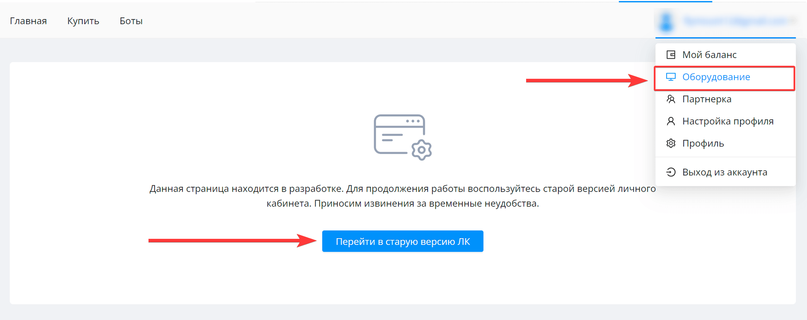
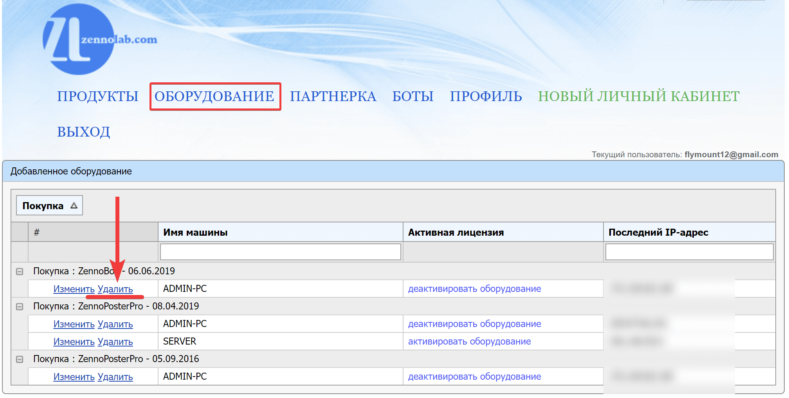

При необходимости вы можете перенести шаблон вместе с ZennoPoster / ZennoBox на другое устройство. Ограничений по количеству переносов с устройства на устройство нет, но есть ограничение по частоте - **не больше 1 раза в час.**

Не пытайтесь установить ZennoPoster / ZennoBox на новое устройство пока не удалите привязку предыдущего устройства в личном кабинете. В последствии могут начаться проблемы с получением лицензии из-за которых ZennoPoster / ZennoBox перестанут запускаться и установить на новое устройство их будет нельзя!

**Для того чтобы перенести шаблон на другое устройство необходимо:**

1. Полностью удалить ZennoPoster / ZennoBox с компьютера через деинсталлятор или через «Установка и удаление программ» в Windows.

2. Зайти в личный кабинет ZennoLab.

3. Найти в правом верхнем углу кнопку профиля с адресом вашей почты и нажать на неё, где из появившегося выпадающего списка выбрать «**Оборудование**». Вас перенаправят на страницу с кнопкой «**Перейти на старую версию ЛК**» - выполняете переход.

   

4. В старой версии личного кабинета ZennoLab на вкладке «Оборудование» необходимо удалить все записи о привязанных устройствах по кнопке - «**удалить**».

   

5. Подождать 10 минут и затем установить ZennoBox / ZennoPoster на новое устройство.
