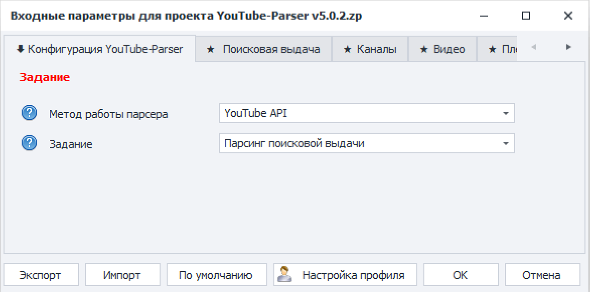

### Как начать парсить YouTube?

На первой вкладке настроек шаблона следует выбрать задание. В зависимости от того какое задание выбрано, данными заполняется соответствующий типу входных данных текстовый файл из папки **YouTube-Parser.**

В тоже время в настройках шаблона на соответствующей заданию вкладке задаются параметры парсинга, фильтрации или дополнительные настройки.

Например, если было выбрано задание **«Парсинг поисковой выдачи»**, то входными данными будут «поисковые запросы», которые необходимо указать в файле **«1_Search_Keywords.txt»** построчно.

### Какой метод парсинга выбрать?

Основной метод парсинга в шаблоне это - **YouTube API**. В подавляющем большинстве случаев необходимо использовать именно его.

**InnerTube API** - это вспомогательный метод, который используется в тех случаях, когда с помощью YouTube API нельзя собрать какие-то данные из-за отсутствия технической возможности.

Например, через InnerTube API можно получить данные о монетизации видео и каналов, собрать ссылки из раздела «О канале», собрать публикации с канала и комментарии под ними, скачать видео и субтитры, получить тренды видео по странам.

Также InnerTube API имеет смысл использовать, если необходимо собрать какое-то кол-во последних видео с канала. В этом случае сбор видео будет происходить быстрее, чем через YouTube API.

### **Где указать входные данные?**

Поисковые запросы, ссылки на каналы, видео, плейлисты, публикации, обложки указываются в текстовых файлах, которые находятся в папке YouTube-Parser в директории проекта.

Название текстового файла определяет тип входных данных, которые он принимает. Для поисковых запросов - **«1_Search_Keywords.txt»**, для ссылок на видео - **«3_Videos_Urls.txt»** итд.

Также в настройках шаблона во всех функциях есть параметр «Входные данные», значения которого также определяет какой тип данных в качестве источника может принять шаблон. В части функций тип входных данных можно менять, в остальной части входные данные могут быть только одного типа.

Например, в функции парсинга метаданных видео есть возможность выбрать входные данные как «Видео» или «Канал». В зависимости от выбранного значения шаблон будет собирать данные видео по ссылкам на видео или собирать данные видео с канала по ссылкам на каналы.

### Как сохранить результат парсинга, если выполнение было прервано и результатов нет?

Для сохранения результатов в случае ошибки во время парсинга, необходимо зайти в папку «**database**», которая находится по пути «..\\\\YouTube-Parser\\\\\[Config\]\\\\database» и проверить наличие файла базы данных. Если файл с базой данных есть, то восстановить данные можно.

**Необходимо запустить YouTube-Parser в 1 выполнение:** `Сколько делать – 1`

При старте шаблона в 1 выполнение он выполнит сохранение результатов из базы данных и создаст отчётные таблицы как и должен.
