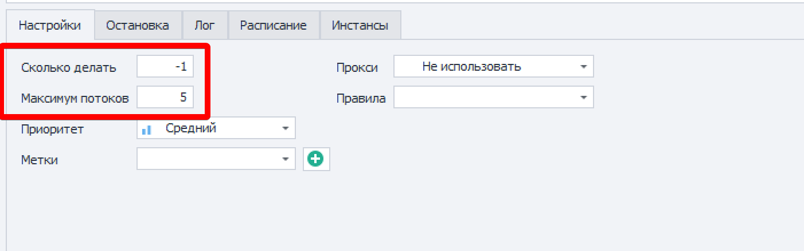
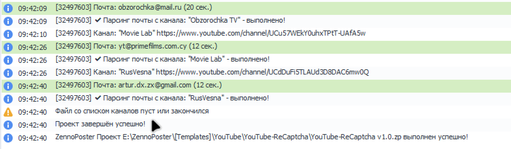
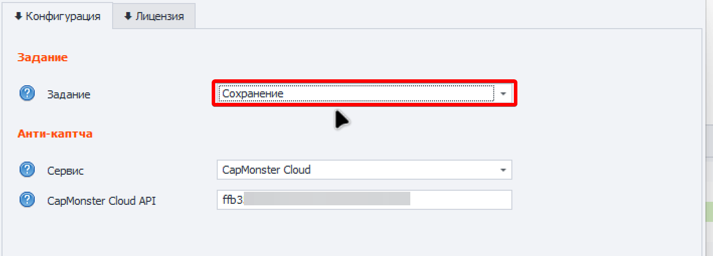
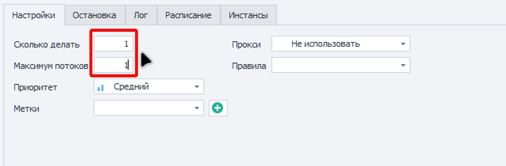
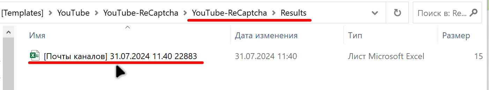

1️⃣ **Запустите шаблон в соответствии с инструкцией:** [**Запуск шаблонов**](https://docs.youtube-dorgen.com/installation/start)

Значение **Сколько делать** укажите по количеству файлов в папке 1_Ready или –1

**2️⃣ После того как файл со ссылками на каналы закончится необходимо выполнить сохранение.**

**3️⃣ Во входных настройках шаблона выберите задание Сохранение**

\
**4️⃣ Укажите такие значения для сохранения результатов:**

`Сколько делать – 1`

`Максимум потоков – 1`

\
**5️⃣ Таблица с результатами появится в папке Results**

