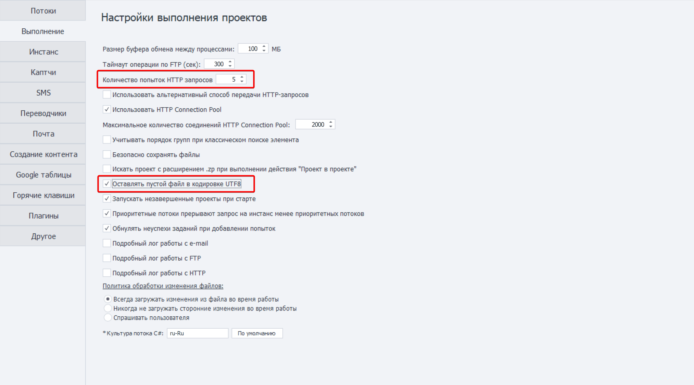

**1️⃣ В настройках ZennoBox на вкладке «Выполнение» установите значение количества попыток HTTP-запросов на** **–** `5` и включите опцию `Оставлять пустой файл в кодировке UTF8`

**2️⃣ На вкладке «Инстанс» увеличьте значение**  `Таймаут ожидания инициализации объектов` **до 5 секунд**

3️⃣**Здесь же на вкладке «Инстанс» включите использование** `GPU для работы WebGL` **, а затем закройте** **настройки и перезапустите ZennoBox**

4️⃣**Запустите ZennoBox снова и на нижней панели перейдите на вкладку «Остановка» указав следующие параметры:**

5️⃣**Перейдите к архиву Extensions.zip, который был скачан из облака. Разархивируйте архив и перенесите содержимое в папку:** `../YouTube-ReCaptcha/[Config]/storage/EXTENSIONS_352_01/`

6️⃣**Обратите внимание на путь куда были извлечены файлы из архива. Не должно быть лишних подпапок с одинаковыми именами!**

