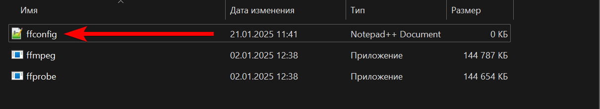
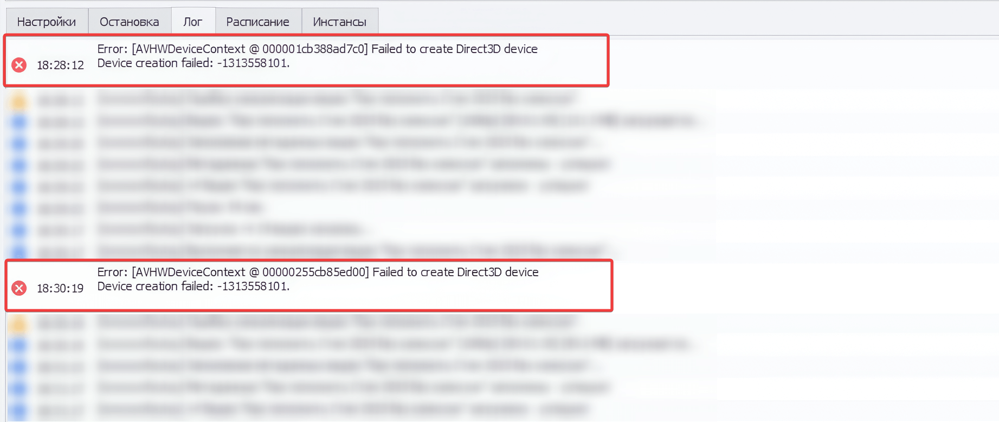

#### Уникализация видео

Если на этапе уникализации видео появляется ошибка c текстом `Device creation failed`, то в таком случае создайте текстовый файл в папке **“..\\\\YouTube-Uploader\\\\\[Config\]\\\\libs\\\\”** с названием **“ffconfig”** и в нём укажите параметр: `hwaccelauto=off`

Это отключит аппаратное ускорение при уникализации видео, использование которого может вызывать ошибку на некоторых системах или серверах.

:::danger:true Скриншот ошибки

:::
