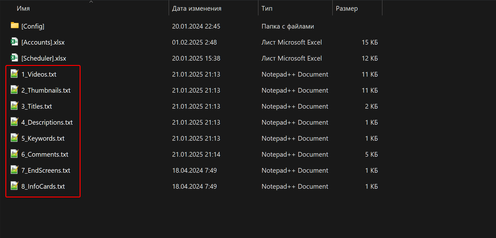

Файлы удобны тем, что их можно заполнить один раз и использовать по кругу, загружая пул одних и тех же видео в случайном порядке или по очереди.

В папке проекта находится 8 файлов, каждый из которых соответствует определённой категории данных видео на YouTube. Определите, какие данные должны быть заполнены для ваших видео. Если какие-либо данные не нужны, например `подсказки` или `конечные заставки`, их можно отключить, а файлы, соответствующие этим данным, оставить пустыми.



#### **Как заполнять файлы с данными для загрузки видео?**

**«1_Videos.txt»** – пути к видео файлам для загрузки видео

```
D:\Videos\video_00001.mp4
D:\Videos\video_00002.mp4
D:\Videos\video_00003.mp4
D:\Videos\video_00004.mp4
D:\Videos\video_00005.mp4
```

**«2_Thumbnails.txt»** – пути к файлам изображений для загрузки обложек к видео

```
D:\Images\image_00001.jpg
D:\Images\image_00002.jpg
D:\Images\image_00003.jpg
D:\Images\image_00004.jpg
D:\Images\image_00005.jpg
```

Чтобы скопировать сразу все пути к файлам из папки, можно использовать средства Wnidows по этой инструкции: [Смотреть видео](https://www.youtube.com/watch?v=Z4V6sIms4k4)

**«3_Titles.txt»** – названия для видео

```Plaintext
Секреты Интернет-заработка: Практические шаги к финансовой независимостиой
От Новичка к Профи: Эффективные Способы Заработка в Сети
Интернет-Заработок 2023: Топовые Стратегии и Трюки
Пассивный Доход Online: Как Создать Свой Путь к Успеху
Зарабатывайте Деньги, Не Вставая с Кресла: Лучшие Интернет-Идеи для Дохода
```

**«4_Descriptions.txt»** – описания для видео

```
Откройте для себя новые возможности заработка в онлайне с моими проверенными советами и стратегиями! 💻💰"
Быстро и легко: узнайте, как начать зарабатывать в интернете прямо сейчас! 🚀💸"
Забудьте о 9-5! Узнайте, как создать стабильный доход онлайн с минимальными усилиями. 💼🌐"
Эксклюзивные секреты успешного интернет-заработка: простые шаги к финансовой свободе! 🌟💻"
Погружение в мир онлайн-заработка: откройте для себя лучшие методы для быстрого и эффективного дохода! 💡💳"
```

**«5_Keywords.txt»** – теги для видео

```
Онлайн заработок
Доход в интернете
Фриланс
Пассивный доход
Способы заработка
Бизнес онлайн
Фрилансер
Интернет бизнес
Финансовая независимость
Заработать деньги
Блогер заработок
Фриланс на дому
Инвестиции онлайн
Фриланс платформы
Эффективный заработок
Онлайн предприниматель
Пассивный доход инвестиции
Интернет маркетинг
Фриланс навыки
Заработок в сети
```

**«6_Comments.txt»** – комментарии для видео

```
Это видео — настоящая находка! Спасибо за четкие и эффективные советы по заработку в интернете. Уже начал применять и видимые результаты!
Очень информативный контент! Ваши рекомендации действительно помогают разобраться с миром онлайн-заработка. Благодарю за ваши ценные советы!
Наконец-то нашел видео, которое не только обещает, но и дает реальные инструменты для заработка. Спасибо за честность и полезную информацию!
Вы просто мастерство в деловых секретах онлайн-бизнеса! Ваши идеи не только вдохновляют, но и мотивируют действовать. Спасибо за ваше талантливое руководство!
Это видео – настоящий курс по заработку в интернете! Очень нравится ваш подход и методичность в объяснении сложных вещей. С нетерпением жду новых видео!
```

**«7_EndScreens_Urls.txt»** – URL ссылки для добавления конечных заставок на видео

```
https://www.youtube.com/channel/ID
https://www.youtube.com/watch?v=ID
https://www.youtube.com/playlist?list=ID
```

```
Самое новое
Самое подходящее
Подписка
```

**Переопределение файлов с данными видео на пользовательские.**

Чтобы задать для каждого видео конкретные данные, можно переопределить файлы с данными, заменяя их из папки проекта на пользовательские. При этом используется тот же набор файлов, что и в папке проекта, но файлы могут находиться в другой директории, иметь другие названия, а для каждого аккаунта можно указать уникальный набор данных.

Для связывания пользовательских файлов с аккаунтами необходимо использовать линкер. Создайте текстовые файлы и заполните их данными. Затем откройте таблицу \[Accounts\] и перейдите на второй лист с названием **Linker**. В колонках, предназначенных для указания путей к файлам, укажите путь к соответствующим файлам с нужным типом данных.

Если какие-либо данные заполнять не нужно, отключите их в настройках шаблона – тогда шаблон не будет требовать наличия этих файлов. Также можно задать только часть пользовательских файлов, чтобы остальные данные брались из файлов в папке проекта. Для этого укажите путь только к тем файлам, которые хотите переопределить.

При использовании пользовательских файлов следует удалить путь к **планировщику** в линкере, так как у планировщика приоритет выше, и шаблон либо подключит его, либо потребует его наличия.

Чтобы отключить линкер и вернуться к использованию файлов из папки проекта, смените режим работы потоков на **«Общий»** или **«Выделенный»**.
